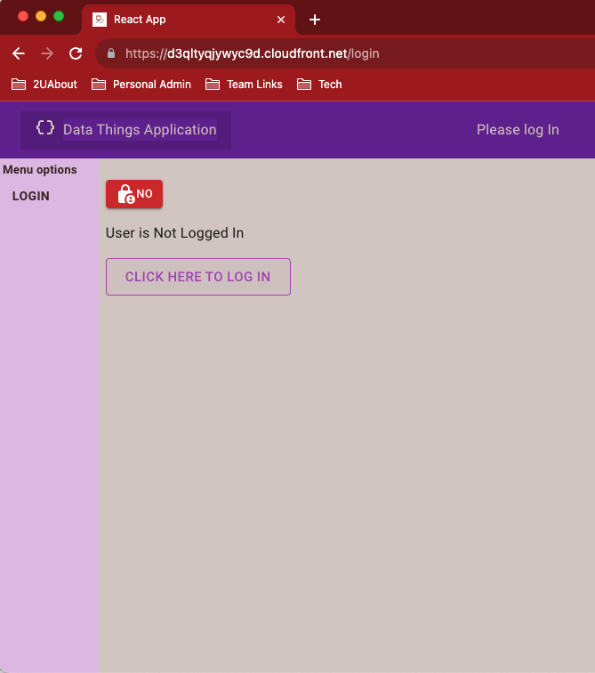
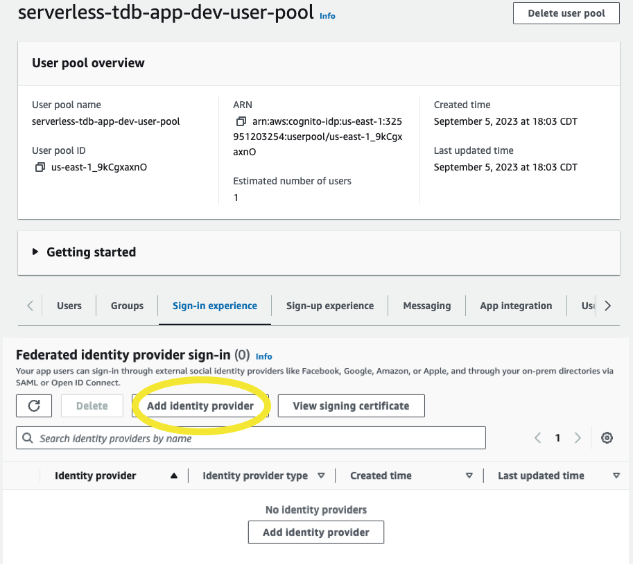
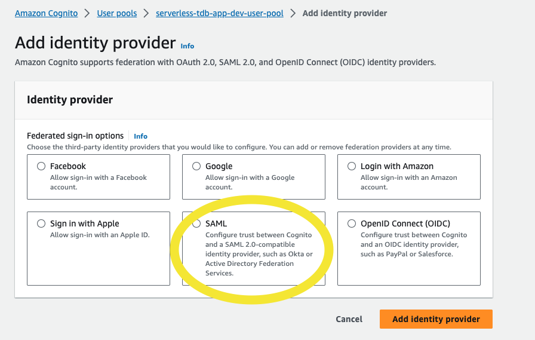
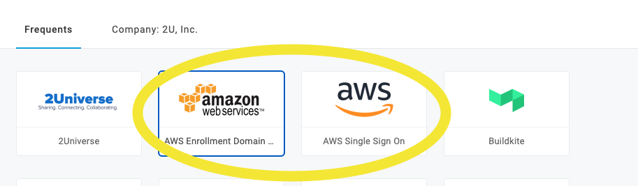
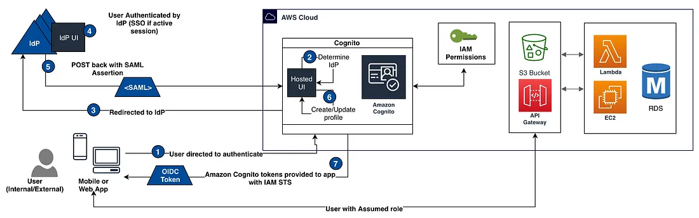
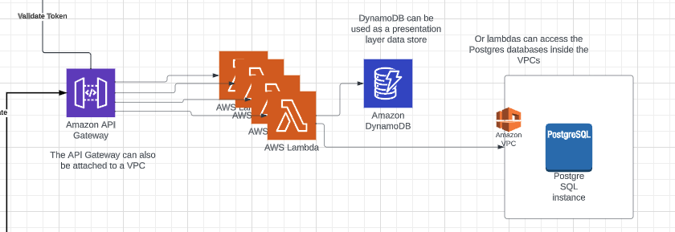
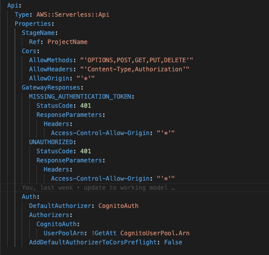
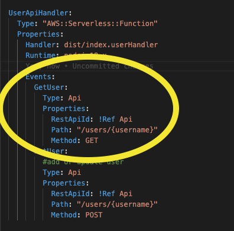

# Demo React Serverless Application

An overview of the Demo React Serverless Application here: 

<https://github.com/teisha2U/serverless-react>

LucidChart: <https://lucid.app/lucidchart/5d46efd7-3464-4e98-a93f-aff6ce9fc02c/edit?invitationId=inv_50be9c54-dfd2-4362-b8e4-7e6fa6c94a7c&page=0_0#>

****

# Application

The application is a plain React app created by installing the libraries manually and adding Typescript.  This is the messiest part of the demo, because the content isn’t intended to be anything _juicy_ and I just pulled pieces from some experimental apps that I have.    

<ins>**Libraries**</ins>:  
React 18 with Typescript  
Material UI  
Axios for http calls  
Zod for shared data structures between backend and frontend  

The Auth module is separate from the rest of the application. It contains an Auth context to hold the auth state, including the token, loggedIn status, and the username.  There is also an Auth guard to wrap around pages to enforce a logged in status.  And it includes the pages that are used in the redirects for login and logout.  

There is also an Application context that holds the config values and an alert that’ll pop up at the main page layout level.  

The demo app includes just one form that reads and writes data to DynamoDb.  

****

# Deploy

The application is deployed using NPM workspaces - the only npm commands that are run are on the root of the project.

In order to deploy the application, the backend is deployed first, which contains the infrastructure template and lambda code.  Then the React application is built and copied into the Host Bucket created by the backend.

To see steps involved in the deploys, you just need to look at the npm commands in the package.json on the root of the project, and follow them back to the backend and frontend npm commands.  

****

# AWS Objects

## Front End

#### Create an S3 Bucket to hold the website.  

S3 can be configured to serve up a static website by configuring the bucket to serve as an [endpoint.](https://docs.aws.amazon.com/AmazonS3/latest/userguide/WebsiteHosting.html)  This means that it can serve up a React application as a single-page application that goes through the index.html page. 

But there are limitations on what S3 can do, for instance - you can’t use HTTPS with S3 web endpoints, so, instead, we block public access to the files in the bucket and use [CloudFront as the Front End "server".](https://docs.aws.amazon.com/AmazonCloudFront/latest/DeveloperGuide/Introduction.html)  CloudFront is an AWS service that focuses on distribution of web content.

#### Creating a CloudFront distribution

The CloudFront distribution will create a domain and associate it with an origin - which, in this case, is an [S3 bucket](https://docs.aws.amazon.com/AmazonCloudFront/latest/DeveloperGuide/DownloadDistS3AndCustomOrigins.html).  The distribution lets your web application take advantage of CloudFront [edge locations and caching](https://docs.aws.amazon.com/AmazonCloudFront/latest/DeveloperGuide/RequestAndResponseBehaviorS3Origin.html#RequestBehaviorS3Origin).

For the React website, the distribution is configured to point to the index.html file forcing all errors and page requests to be handled by the SPA. Since there’s no server, it does mean that React’s Server Side Rendering isn’t going to work, but in some cases, Edge Lambdas can be used to get that functionality.

Because the connection between the bucket and the distribution happens over the internet, the authenticated requests are handled through an Origin Access Control [restricting access between the S3 Bucket and CloudFront Origin](https://docs.aws.amazon.com/AmazonCloudFront/latest/DeveloperGuide/private-content-restricting-access-to-s3.html).

&#x20;

CloudFront managed Origin request policies

https\://docs.aws.amazon.com/AmazonCloudFront/latest/DeveloperGuide/using-managed-origin-request-policies.html

****

## Authentication

#### Cognito

The Cognito resource has three pieces that need to be created: the UserPool, UserPoolClient, and UserPoolDomain. The [UserPool is the container](https://docs.aws.amazon.com/cognito/latest/developerguide/cognito-user-identity-pools.html) that will house the objects that drive the authentication and authorization for an application.  The [UserPoolClient](https://docs.aws.amazon.com/AWSCloudFormation/latest/UserGuide/aws-resource-cognito-userpoolclient.html) specifies some of the OAuth configuration between Cognito and the client application. The [UserPoolDomain](https://docs.aws.amazon.com/AWSCloudFormation/latest/UserGuide/aws-resource-cognito-userpooldomain.html) creates the hosts that the application will use to log in and log out.

The Login page sends the user to authenticate through the Cognito User Pool through a [redirect to the Cognito UserPoolDomain](https://docs.aws.amazon.com/cognito/latest/developerguide/authorization-endpoint.html) created in the template.  When the user is authenticated, they are redirected back to the application with a URL that contains the auth token that’ll be needed to make backend requests. 

The CallbackURL in the CognitoUserClient enforces CORS between the application hosted on Cloudfront and the CognitoUserDomain.  You’ll get CORS errors if the location you’re redirecting back to in your application does not match the CallbackURLs Parameter supplied when the UserPoolClient was created.  Make sure that localhost isn’t in the list when the application is deployed to a production environment.

As an alternative to using redirects, AWS offers some javascript packages through its AWS Amplify libraries that can be added to the React application to authenticate with Cognito.

<small>https\://serverless-tdb-app-dev.auth.us-east-1.amazoncognito.com/login?response\_type=token\&client\_id=4bs30hobrn4ibavor2hlnukkmm\&redirect\_uri=https\://d3qltyqjywyc9d.cloudfront.net/auth\&state=Is%20the%20cognito%20set%20up</small>

|  React App Login Page |   Cognito Login Page |
|  -------------------- |  ------------------- |
|  |  |

This is the URL redirecting to Cognito in the example above:

https\://serverless-tdb-app-dev.auth.us-east-1.amazoncognito.com/login?  
response\_type=token&  
client\_id=4bs30hobrn4ibavor2hlnukkmm&  
redirect\_uri=<https://d3qltyqjywyc9d.cloudfront.net/auth&>  
state=Is%20the%20cognito%20set%20up  

These values are taken from the output of the CloudFormation stack when the template is run

|  Outputs  |
| --------------------------------------------------|
| **Key:**  CognitoRedirectUri      **Description:** Redirect URI to front end from Cognito User Pool     **Value:**  https\://d3qltyqjywyc9d.cloudfront.net/auth |
|  **Key:**   CognitoClientId    **Description:**  Cognito client ID    **Value:**  4bs30hobrn4ibavor2hlnukkmm |  
|  **Key:**   CognitoDomain    **Description:**  Cogntio Domain    **Value:**  serverless-tdb-app-dev |  

####

#### Integration with OneLogin

In order to integrate Cognito with OneLogin, you need to first set up the application in OneLogin and use the configuration to create the Identity Provider in IAM. 

There are [instructions online from AWS](https://repost.aws/knowledge-center/cognito-saml-onelogin), and probably from OneLogin, on how to do this.  It is a feature of both products to integrate with each other.  There are a few manual steps that need to be done, because some pieces are created separately in OneLogin and AWS before they can be used in Cognito.

Once the Identity Provider exists, it can be added to the Cognito User Pool as a SAML Identity Provider, which will hook the authentication from OneLogin into the Cognito client.  It will also create a tile on the users’ OneLogin page.

|  UserPool - Add FederatedId |   Add SAML Identity Provider |
|  -------------------- |  ------------------- |
|  |  |

Unfortunately, this is not going to get the user to the application, so another OneLogin application tile is needed to point to the Index.html of the application.  It means that the users get two tiles on their OneLogin page, but only one of them is pointing to the actual application.

You can see this is what was done to add our AWS Access through OneLogin.

This is a really nice diagram of how OneLogin works with Cognito, other AWS services and Web Applications.  It was taken from an older [write-up of integrating Cognito and AWS](https://medium.com/@anjanava.biswas/aws-cognito-user-pool-federation-with-onelogin-idp-4b1962127b0b) that’s still relevant, but the screenshots of the Cognito console look different now.

****

## Back End

The backend piece of the serverless React app is built on Lambdas called through the API Gateway.

#### Api Gateway

The [AWS::Serverless::Api resource](https://docs.aws.amazon.com/serverless-application-model/latest/developerguide/sam-resource-api.html) used in the template is a SAM resource (meaning the command used to deploy the template is “sam deploy”, as opposed to “aws cloudformation create-stack”)

The API Gateway creates an **HTTPS** Endpoint.  The endpoint is accessed through the internet, so the CORS needs to be enabled, but the CORS endpoints are specified in the lambdas in the return response, not defined in the API Gateway resource properties.

 

The other resource needed is an Authorizer, which will tell the API Gateway how to authorize the traffic when it hits the endpoint.  In order to tie the authentication back to the token received from Cognito, the Authorizer for this API Gateway is a Cognito Authorizer that points back to the Cognito UserPool created in the template.  

Authorizers can also be lambdas that validate parts of the request with custom logic.

#### Lambdas

Lambdas are associated with the API Gateway through Api Events added to the lambda resource. The events define the HTTP method and the path that will be created in the API Gateway.

****

| Add API Gateway | Add Lambda Routes to Gateway |
| --------------  |  ----------- |
|  | 

****

AWS also has some great code examples available, including a React serverless demo app, so you can also look [here](https://github.com/aws-samples/react-cors-spa/tree/main) for another simplified implementation.  There are a lot of different ways to put these together, but you can also build a solid template and reuse it to create new applications.